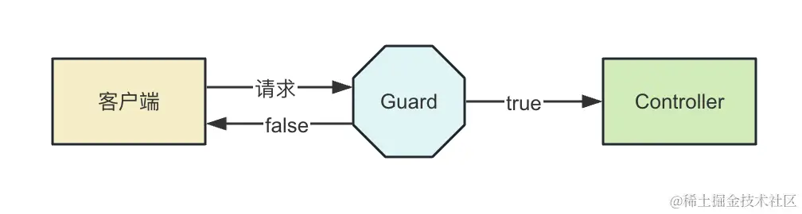
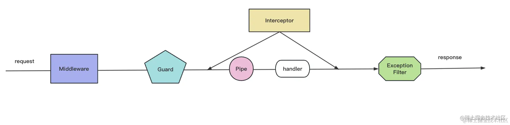

# AOP

**后端架构一般都是MVC架构，MVC是Model View Controller的简写，请求一般会先发送到Controller 然后由它调用Model层的service来完成业务逻辑，最后返回View**

::: tip 什么是AOP
AOP (Aspect Oriented Programming) 面向切面编程，是一种编程范式
一个请求过来会经过 Controller - service - Repository - DB 这样的一条链路，AOP就是在这条链路上加上一些额外的逻辑，比如日志、权限校验、异常处理等等

如果直接在Controller中去写这些逻辑，会与业务代码混淆，不利于维护，AOP就是为了解决这个问题,实现无侵入业务式的编程

Express的中间件的洋葱模型也是一种AOP的视线，因为你可以透明的在外包一层，加入一些逻辑，内层感知不到

而Nest实现AOP的方式很多，Middleware(中间件) Gurad(守卫) Pipe(管道) Interceptor(拦截器) ExceptionFilter(异常过滤器)
:::

## 中间件

> 中间件是Express的概念，Nest底层是Express/fastify(可选)，所以Nest也有中间件的概念,进一步区分为全局中间件和路由中间件

### 全局中间件 Middleware

```ts
// main.ts
async function bootstrap() {
  const app = await NestFactory.create(AppModule);
  app.use((req, res, next) => {
    // req: 是一个对象，包含了请求的所有信息
    // res: 是一个对象，包含了响应的所有信息
    // next: 是一个函数，用来执行下一个中间件:放行请求,不写的话，请求就会被挂起
  });
  await app.listen(3000);
}
bootstrap();
```

#### 路由中间件

> 路由中间件首先要创建一个中间件类，然后在路由上使用
>
> 1. 创建中间件类 nest generate middleware logger --no-spec --flat  no-spec 不生成测试文件 flat 不生成文件夹
> 2. 包含中间件的模块必须实现NestModule接口，让我们在AppModule级别设置中间件
>
```ts
@Module()
export class AppModule implements NestModule{
    configure(consumer: MiddlewareConsumer) {
        consumer.apply(LoggerMiddleware).forRoutes('aaa*'); // [!code ++]
        ||
        consumer.apply(LoggerMiddleware).forRoutes({path:'aaa',method:RequestMethod.GET});// [!code ++]
    }
 }
}
```

### 路由守卫 Guard
  >
  > Guard是路由守卫的意思，可以用于在调用某个Controller之前判断权限，返回True或False来决定是否放行
  > n g gu auth/guards/role --no-spec


 ::: code-group

```ts
// RoleGuard 守卫要实现CanActivate接口,可以从参数Context中获取请求信息
// 然后做一些权限验证，返回true或false

// Role.guard.ts
@Injectable()
export class RoleGuard implements CanActivate {
  canActivate(
    context: ExecutionContext,
  ): boolean | Promise<boolean> | Observable<boolean> {
    console.log('RoleGuard');
    return true;
  }
}

// x.controller.ts
@Controller('x')
export class XController {
  @Get()
  @UseGuards(RoleGuard)
  index() {
    return 'x';
  }
}
```

```ts  [全局启用守卫]
// main.ts 第一种
app.useGlobalGuards(new RoleGuard());
||
// app.module.ts 第二种
@Module({
  imports: [],
  controllers: [],
  providers: [
    AppService,
    {
      provide:APP_GUARD,
      useClass:RoleGuard
    }
  ],
})
export class AppModule{
}
```

:::
::: tip
>如果您仔细观察全局启用守卫中的代码后会注意两种全局注册的方式
>app.useGlobalGuards是手动注册的方式，所以他并不在IOC容器中，所以在守卫中无法使用依赖注入
> 而app.module.ts中的方式是通过依赖注入的方式注册的，所以守卫中可以使用依赖注入

```ts
@Injectable()
export class RoleGuard implements CanActivate {
  @Inject(AppService)// [!code ++]
  private readonly appService: AppService; // [!code ++]

  canActivate(
    context: ExecutionContext,
  ): boolean | Promise<boolean> | Observable<boolean> {
    console.log(this.appService.getHello());
    return true;
  }
}
```

所以，当需要注入别的 provider 的时候，就要用第二种全局 Guard 的声明方式。
:::

### 拦截器 Interceptor
>
> 拦截器是在Controller之前之后执行的一段代码，可以用来做一些通用的逻辑，比如日志、异常处理等等
> nest g interceptor logger --no-spec

```ts
import {
  CallHandler,
  ExecutionContext,
  Injectable,
  NestInterceptor,
} from '@nestjs/common';
import { Observable, tap } from 'rxjs';

@Injectable()
export class TimeInterceptor implements NestInterceptor {
  intercept(context: ExecutionContext, next: CallHandler): Observable<any> {
    const startTime = Date.now();
    return next.handle().pipe(
      tap(() => {
        console.log(`Time: ${Date.now() - startTime}ms`);
      }),
    );
  }
}

```

interceptor要实现NestInterceptor接口，实现intercept方法，调用next.handle()就会调用目标Controller  
time是用来计算Controller执行时间的，tap是rxjs的操作符，用来在Observable的生命周期中的某个点执行副作用，但不会改变Observable的数据流

::: details rxjs-tap
rxjs是一个响应式编程的库
 在RxJS中，tap是一个操作符，它用于在Observable的生命周期中的某个点执行副作用，但不会改变Observable的数据流。在你的代码中，tap用于在Observable完成时打印出执行时间。

 这里的tap操作符接收一个函数，这个函数会在每次Observable发出值时被调用，但不会改变或使用这个值。在你的代码中，这个函数是一个箭头函数，它打印出从开始到现在的时间差。

 这是一个很好的用例，因为你可能想要在不改变Observable流的情况下，记录或打印出一些信息。
:::

**Interceptor 和 Middleware很相似，仔细研究他们的区别**
:::details
Middleware:
定义：Middleware 是一种位于请求和响应处理流程中间的函数，主要用于请求的前置处理。
用途：它们通常用于执行一些关于请求的通用操作，如日志记录、请求验证、设置请求头等。
作用域：Middleware 可以访问请求和响应对象，但不能访问处理请求的路由处理程序的细节。
控制流：Middleware 不能改变控制流，即它们不能决定是否继续处理请求，只能对请求进行一些处理或添加一些额外的信息。
Interceptor:

定义：Interceptor 是基于 AOP（面向切面编程）概念实现的，它可以拦截和修改从一个函数流向另一个函数的数据。
用途：它们通常用于在方法执行之前或之后添加额外的逻辑，如修改返回值、异常映射、扩展基本方法行为、事务管理等。
作用域：Interceptor 可以访问请求上下文，并对请求或响应进行更细粒度的控制。
控制流：它们拥有更大的控制权，可以决定是否继续执行下一个拦截器或路由处理程序，甚至可以完全替换方法的返回值。
:::
简洁版： 他们都是到达请求之前的处理函数，但是权限和作用不同，interceptor权限更大，因为他可以获取到请求的上下文，而middleware只能获取到请求和响应对象
在 controller 和 handler 上加一些 metadata，这种就只有 interceptor或者 guard 里可以取出来，middleware 不行。

Interceptor支持每个路由单独启用，只作用于某个handler

```ts
@Get('bbb')
@UseInterceptors(TimeInterceptor)
bbb():string{
  console.log('bbb...')
  return 'bbb'
}

```

也可以在Controller级别启动，作用于下面的全部handler

```ts
@Controller()
@UseInterceptors(TimeInterceptor)
export class AppController{

}
```

也可以作用于全局

```ts
// main.ts
app.useGlobalInterceptors(new TimeInterceptor())
||
// App.Module.ts
@Module({
  imports:[],
  controllers:[AppController],
  providers:[
    AppService,
    {
      provide:APP_INTERCEPTOR
      useClass:TimeInterceptor
    }
  ]
})
```

第二种方式跟guard作用相同

## Pipe
>>
>> Pipe是管道的意思 ，用来对参数做校验和转换
>>除了路由的权限控制、目标 Controller 之前之后的处理这些都是通用逻辑外，对参数的处理也是一个通用的逻辑，所以 Nest 也抽出了对应的切面，也就是 Pipe
> nest g pipe validate --no-spec --flat

```ts
import { ArgumentMetadata, Injectable, PipeTransform } from '@nestjs/common';

@Injectable()
export class ValidatePipe implements PipeTransform {
  transform(value: any, metadata: ArgumentMetadata) {
    if (Number.isNaN(parseInt(value))) {
      throw new BadRequestException('Validation failed');
    }
    return value;
  }
}
```

Pipe可以拿到Req的参数value,可以对参数进行验证，格式化等操作,验证正确就返回，不正确就抛出异常

使用

```ts
@Controller('aaa')
export  class AppController{
    @Get('b')
    a(@Query('num',ValidatePipe) num:number){
      return num
    }
}
```

 Pipe不仅可以对某个参数生效，也可以对整个Controller/全局生效
 ::: code-group

 ```ts Controller
 @Controller()
 @UsePipes(ValidatePipe)
 export class AppController{}
 ```

``` ts [Main.js]
app.useGlobalPipes(new ValidatePipes())
||
// App.Module.ts
@Module({
  providers:[
    {
      provide:'VALIDATE_PIPE',
      useClass:ValidatePipe
    }
  ]
})

```

:::
>不管是 Pipe、Guard、Interceptor 还是最终调用的 Controller，过程中都可以抛出一些异常，如何对某种异常做出某种响应呢？

## ExceptionFilter
>
>ExceptionFilter 可以对抛出的异常做处理，返回对应的响应：

1. 创建一个filter n g filter test --no-spec --flat
::: code-group

```ts [validate.pipe.ts]
  @Injectable()
export class ValidatePipe implements PipeTransform {
  transform(value: any, metadata: ArgumentMetadata) {
    if (Number.isNaN(parseInt(value))) {
      //此时Pipe验证参数失败，抛出异常错误被ExceptionFilter接收，参数传递给exception // [!code ++]
      throw new BadRequestException('我想要的是Number类型'); // [!code ++]
    }
    return value;
  }
}
```

```ts [ExceptionFilter/ test.filter.ts]
// pipe抛出异常进入异常过滤器
@Catch(BadRequestException)
export class TestFilter implements ExceptionFilter {
  catch(exception: BadRequestException, host: ArgumentsHost) {
    const response: Response = host.switchToHttp().getResponse();
    response.status(400).json({
      statusCode: 400,
      message: 'test: ' + exception.message,
    });
  }
}
```

```ts [aaa.Controllet.ts]
  @Get()
  @UseFilters(TestFilter)
  findAll(@Query('num', ValidatePipe) num: number) {
    return this.aaaService.findAll();
  }
```

:::

::: details
Nest 内置了很多 http 相关的异常，都是 HttpException 的子类：

- BadRequestException

- UnauthorizedException

- NotFoundException

- ForbiddenException

- NotAcceptableException

- RequestTimeoutException

- ConflictException

- GoneException

- PayloadTooLargeException

- UnsupportedMediaTypeException

- UnprocessableException

- InternalServerErrorException

- NotImplementedException

- BadGatewayException

- ServiceUnavailableException

- GatewayTimeoutException
:::

**也可以自己扩展**

```ts
export class ForbiddenException extends HttpException{
    constructor(){
      super('Forbidden',HttpStatus.FORBIDDEN)
    }
}
```

Nest 通过这样的方式实现了异常到响应的对应关系，代码里只要抛出不同的异常，就会返回对应的响应，很方便。

# AOP执行顺序

0. Middleware是继承的Express 在最外层调用
1. 进入路由先调用Guard判断是否有权限
2. 如有权限会跳到拦截器，拦截器组织了一个链条通过next()调用，直至Controller
3. 到Controller之前会先调用Pipe判断是否有权限
4. ExceptionFilter 的调用时机很容易想到，就是在响应之前对异常做一次处理。



# 总结

Nest 基于 express 这种 http 平台做了一层封装，应用了 MVC、IOC、AOP 等架构思想。

MVC中请求先经过 Controller，然后调用 Model 层的 Service、Repository 完成业务逻辑，最后返回对应的 View。

IOC 是指 Nest 会自动扫描带有 @Controller、@Injectable 装饰器的类，创建它们的对象，并根据依赖关系自动注入它依赖的对象，免去了手动创建和组装对象的麻烦。

AOP 则是把通用逻辑抽离出来，通过切面的方式添加到某个地方，可以复用和动态增删切面逻辑。

Nest 的 Middleware、Guard、Interceptor、Pipe、ExceptionFilter 都是 AOP 思想的实现，只不过是不同位置的切面，它们都可以灵活的作用在某个路由或者全部路由，这就是 AOP 的优势。

我们通过源码来看了它们的调用顺序，Middleware 是 Express 的概念，在最外层，到了某个路由之后，会先调用 Guard，Guard 用于判断路由有没有权限访问，然后会调用 Interceptor，对 Contoller 前后扩展一些逻辑，在到达目标 Controller 之前，还会调用 Pipe 来对参数做检验和转换。所有的 HttpException 的异常都会被 ExceptionFilter 处理，返回不同的响应。

Nest 就是通过这种 AOP 的架构方式，实现了松耦合、易于维护和扩展的架构。
