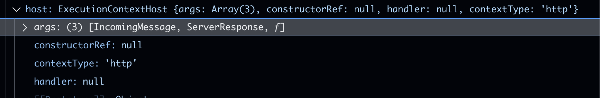
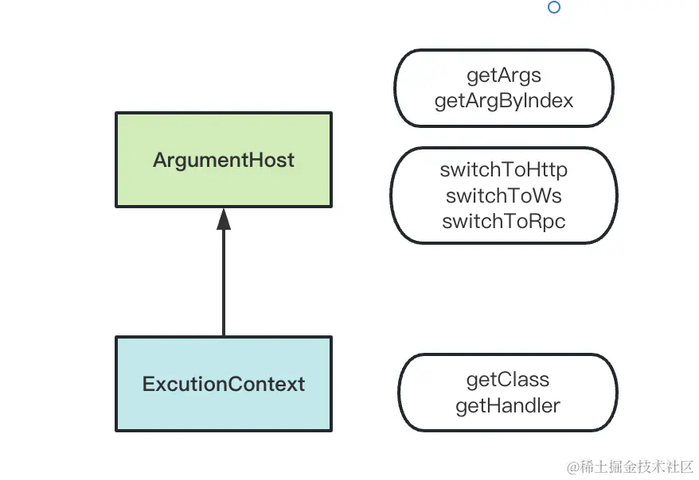

# Exception切换不同上下文

> NestJS支持 HTTP服务 WebSocket服务 TCP通信服务
> 不同类型的服务在Guard/interceptor 等取到的功能不同,导致无法复用
> ArgumentHost 和 ExecutionContext 取到上下文和参数，获取到哪个服务，然后在代码中if else进行处理

**执行顺序DEMO**
::: code-group

```ts [controller.ts]
@Controller()
export class AppController {
  private readonly appService: AppService;

  @Get()
  @UseFilters(MyexceptionFilter)
  getHello() {
    // MyexceptionFilter只能捕获AaaException异常，不能捕获HttpException异常
    // 因为exceptionFilter的@Catch(AaaException)中指定了AaaException异常处理
    throw new AaaException('错误错误', '错误啦');
    // 不会处理http异常,因为Catch没有指定HttpException异常
    throw new HttpException('错误错误', 400);
  }
}

```

```ts [exception.filter.ts]
import { AaaException } from './aaa.exception';

// 捕获 AaaException 异常
@Catch(AaaException)
export class MyexceptionFilter<T> implements ExceptionFilter {
  catch(exception: T, host: ArgumentsHost) {
    console.log('过滤器异常');
  }
}

```

```ts [AaaException.ts]
export class AaaException {
    controller(public a:string,public b:string){
       console.log('触发了AaaException异常')
    }
}
```

> log : 自定义异常 > 过滤器异常
:::

## exceptionFilter 参数 exceptions argumentsHost 切换不同上下文

<!-- ```ts
import { AaaException } from './aaa.exception';

@Catch(AaaException)
export class MyexceptionFilter<T> implements ExceptionFilter {
  catch(exception: T, host: ArgumentsHost) {
    console.log(exception,host)
    // { a: '错误错误', b: '错误啦' }
  }
}
``` -->

```ts
import { ArgumentsHost, Catch, ExceptionFilter } from '@nestjs/common';
import { Response } from 'express';
import { AaaException } from './AaaException';

@Catch(AaaException)
export class AaaFilter implements ExceptionFilter {
  catch(exception: AaaException, host: ArgumentsHost) {
    if(host.getType() === 'http') {
      const ctx = host.switchToHttp(); //切换至http上下文
      const response = ctx.getResponse<Response>();
      const request = ctx.getRequest<Request>();

      response
        .status(500)
        .json({
          aaa: exception.aaa,
          bbb: exception.bbb
        });
    } else if(host.getType() === 'ws') {

    } else if(host.getType() === 'rpc') {

    }
  }
}

```

- exception 为异常的实例
- host 主机参数 分辨 http ws rpc 等不同上下文
ArgumentHost 是用于切换 http、ws、rpc 等上下文类型的，可以根据上下文类型取到对应的 argument。
 没截到-.-

参数arg里的就是当前上下文的参数 request response next
.getArgs 方法就是取出当前上下文的 reqeust、response、next 参数。

如果是 ws、基于 tcp 的微服务等上下文，就分别调用 host.swtichToWs、host.switchToRpc 方法。

## Guard等切换上下文

```ts
@Injectable()
export class GuardExceptionGuard implements CanActivate {
  canActivate(
    context: ExecutionContext, // [!code focus]
  ): boolean | Promise<boolean> | Observable<boolean> {
    context.getClass
    context.getHandler

    return true;
  }
}
```

这个ExecutionContext是ArgumentsHost的子类,扩展了 getClass、getHandler 方法。

- getClass 获取当前上下文的类 Controller
- getHandler 获取当前上下文的方法 Controller下的方法


## 为啥要多俩方法 getClass getHandler

比如守卫验证权限使，需要获取目标方法的元数据，就可以通过 getHandler 方法获取到目标方法的元数据。
然后比对决定是否放行

```ts
import { CanActivate, ExecutionContext, Injectable } from '@nestjs/common';
import { Reflector } from '@nestjs/core';
import { Observable } from 'rxjs';
import { Role } from './role';

@Injectable()
export class AaaGuard implements CanActivate {
  constructor(private reflector: Reflector) {}

  canActivate(
    context: ExecutionContext,
  ): boolean | Promise<boolean> | Observable<boolean> {

    // 获取目标方法的元数据
    const requiredRoles = this.reflector.get<Role[]>('roles', context.getHandler());

    if (!requiredRoles) {
      return true;
    }

    // 获取当前请求上下文的用户信息
    const { user } = context.switchToHttp().getRequest();
    // 如果用户角色包含目标方法的元数据，就放行
    return requiredRoles.some((role) => user && user.roles?.includes(role));
  }
}

```

## 总结

> 为了让Filter Guard Exception 支持http ws rpc等场景下复用,Nest 设计了ArgumentHost 和 ExecutionContext 类

>ArgumentHost 可以通过 getArgs 或者 getArgByIndex 拿到上下文参数，比如 request、response、next 等。

> 更推荐的方式是根据 getType 的结果分别 switchToHttp、switchToWs、swtichToRpc，然后再取对应的 argument。

> 而 ExecutionContext 还提供 getClass、getHandler 方法，可以结合 reflector 来取出其中的 metadata。
