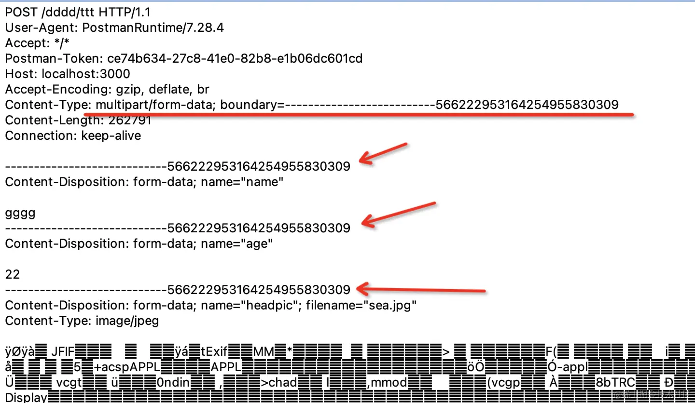

# HTTP数据传输方式

- url param
- query  
- form-urlencoded
- form-data
- json
- **encode**: 将...编译

## urlParam/Query

**都属于GET路径传参**

```tsx
params：/router1/:id ，    //router1/123，/router1/789 ,这里的id叫做params
--------------------
query：/router1?id=123 ,  //router1?id=456 ,这里的id叫做query。
// 其中非英文的字符和一些特殊字符要经过编码，可以使用 encodeURIComponent 的 api 来编码：
const query = const query = "?name=" + encodeURIComponent('光') + "&age=20"
// ?name=%E5%85%89&age=20
```

## form-urlencoded

直接用表单提交数据，提交的就是这种
他和query的区别就是把查询的query放在了body里,然后指定下 content-type 是 application/x-www-form-urlencoded

```jsx
POST /a/b HTTP/1.1
User-Agent : PostmanRunTime/7.23
Accept:*/*
Host:localhost:3000
Accept-Encoding:gzip,deflate,br
Content-Type:application/x-www-form-unlencoded
Content-Length:21
Connection:keep-alive
name = %E5%85%89&age=22
```

**因为内容是表单搜索，所以跟query差不多(都需要urlEncoded编译一下**

**get 是把数据拼成 query 字符串放在 url 后面，于是表单的 post 提交方式的时候就直接用相同的方式把数据放在了 body 里。**

:::tip
通过&分割的数据需要encoded编译一下，如果大量的数据那么都需要去编译，太耗费资源和时间
所以需要更好的方式来传递大量数据form-data
:::

## form-data

form data 不再是通过 & 分隔数据，而是用 --------- + 一串数字做为 boundary(分隔符)。因为不是 url 的方式了，自然也不用再做 url encode。
    <!-- 引入图片 -->

form-data 需要指定 content type 为 multipart/form-data，然后指定 boundary 也就是分割线。

body 里面就是用 boundary 分隔符分割的内容。

很明显，这种方式适合传输文件，而且可以传输多个文件。

但是毕竟多了一些只是用来分隔的 boundary，所以请求体会增大。

## Json

 form-urlencoded 需要对内容做 url encode，而 form data 则需要加很长的 boundary，两种方式都有一些缺点。如果只是传输 json 数据的话，不需要用这两种。

可以直接指定content type 为 application/json 就行

## Nest实现基本的http请求

::: code-group

```ts [query/param]
// [http.controller.ts]
// query: /router1?id=123 
// param : /router/1

在 Nest 里，通过 @Query 装饰器来取：

@Get('find')
  findAll(@Query('name') name: string, @Query('age') age: number) {
    return `This action returns all http. Name: ${name} Age: ${age}`;
 }

@Get(':id')
  // 把所有的参数都放到一个对象里面
  findOne(@Param() params) {
    console.log(params);
    return `This action returns a #${params} http`;
  }
```

```ts [form urlencoded]
// form-urlencoded 是通过Body传输数据，其实是把query字符串放在了body里，这里需要做url encode axios默认自动编译
// Content-Type: application/x-www-form-urlencoded  body: name=%E5%85%89&age=22

// 用Nest接收的话就是使用@Body装饰器，Nest会解析请求体然后注入到DTO中
// dto : data transfer object 封装数据传输对象
// 1. 创建DTO
// 2. 在controller中使用@Body装饰器
 
 // dto 
export class CreateCatDto {
  @IsString()
  readonly name: string;
  @IsInt()
  readonly age: number;
  @IsString()
  readonly breed: string;
}
 // controller
@Controller('api/person')
export class PersonController{
    @Post('example')
    example(@Body() CreateCatDto: CreateCatDto) {
     return CreateCatDto;
    }
}

// JSON
// JSON 需要指定content-type为aplication/json 内容会以JSON的形式传输
// Content-Type: application/json  body: {"name":"光","age":22}
// 后端代码同样使用 @Body 来接收，不需要做啥变动。form urlencoded 和 json 都是从 body 取值，Nest 内部会根据 content type 做区分，使用不同的解析方式。
// 前端POST默认请求头是application/json，所以不需要指定content-type
// ** JSON和form-urlencode不适合大文件传输，form-data适合
```

```ts [form-data]
// form-data是用-----作为分割传输
// Content-Type:multipart/form-data; boundary=----1231231231
// Nest解析 formdata 使用 Filesinterceptor拦截器，用@UseInterceptors装饰器启用，让后通过@Upload
// edFiles取，同样是@Body获取
  @Post('file')
  @UseInterceptors(
    AnyFilesInterceptor({
      dest: 'uploads',
    }),
  )
  body2(
    @Body() CreateCatDto: CreateCatDto,
    @UploadedFiles() files: Array<Express.Multer.File>,
  ) {
    console.log(files);
    return CreateCatDto;
  }
  // return `${CreateCatDto}` 报错Cannot convert object to primitive value的原因是 CreateCatDto 是一个对象，而不是一个字符串，所以不能直接返回，需要转换成字符串
```

:::
