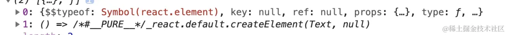

# props

## 监听props改变

函数组件中可以用 useEffect 来作为 props 改变后的监听函数。(不过有一点值得注意, useEffect 初始化会默认执行一次)

``` jsx
  React.useEffect(()=>{
    console.log('props改变',props.number)
  },[props.number])
```

## Render Children 模式

``` jsx
① props 插槽组件

<Container>
    <Children>
</Container>

```

上述可以在 Container 组件中，通过 props.children 属性访问到 Children 组件，为 React element 对象。
作用：

- 可以根据需要控制 Children 是否渲染。
- Container 可以用 React.cloneElement 强化 props (混入新的 props )，或者修改 Children 的子元素。

## Render Props 模式

``` jsx
<Container>
   { (ContainerProps)=> <Children {...ContainerProps}  /> }
</Container>
// ContainerProps 是Container 提供的本质是:
function Container (ContainerProps){
  reutrn ContainerProps.children(ContainerProps)
}
这种方式作用是：
1 根据需要控制 Children 渲染与否。
2 可以将需要传给 Children 的 props 直接通过函数参数的方式传递给执行函数 children 。
```

::: tip
这种情况，在 Container 中， props.children 属性访问到是函数，并不是 React element 对象，针对这种情况，像下面这种情况下 children 是不能直接渲染的，直接渲染会报错。

::: details View The Code

```jsx
function Container(ContainerProps){
  return ContainerProps.children
}
```

:::

:::

## 组合模式

如果 Container 的 Children 既有函数也有组件，这种情况应该怎么处理呢？

``` jsx
<Container>
    <Children />
    { (ContainerProps)=> <Children {...ContainerProps} name={'haha'}  />  }
</Container>

```

首先在 Container 里打印 Children 看看是什么？


此时需要用到一个API(isValidElement)来判断当前children的值是elementDom还是函数

::: details View The Code

``` jsx
const Children = (props)=> (<div>
    <div>hello, my name is {  props.name } </div>
    <div> { props.mes } </div>
</div>)

function  Container(props) {
    const ContainerProps = {
        name: 'alien',
        mes:'let us learn react'
    }
     return props.children.map(item=>{  // [!code focus]
        if(React.isValidElement(item)){ // 判断是 react elment  混入 props // [!code focus] 
            return React.cloneElement(item,{ ...ContainerProps },item.props.children)// [!code focus]
        }else if(typeof item === 'function'){// [!code focus]
            return item(ContainerProps)// [!code focus]
        }else return null// [!code focus]
     })// [!code focus]
}

const Index = ()=>{
    return <Container>
        <Children />
        { (ContainerProps)=> <Children {...ContainerProps} name={'haha'}  />  }
    </Container>
}

```

:::

这种情况需要先遍历 children ，判断 children 元素类型：

- 针对 element 节点，通过 cloneElement 混入 props
- 针对函数，直接传递参数，执行函数。

##

## 操作Props 抽象Props

::: tip
抽象 props 一般用于跨层级传递 props ，一般不需要具体指出 props 中某个属性，而是将 props 直接传入或者是抽离到子组件中。
:::

### 混入 props

::: details View The Code

``` jsx
function Son(props){
    console.log(props)
    return <div> hello,world </div>
}
function Father(props){
    const fatherProps={
        mes:'let us learn React !'
    }
    return <Son {...props} { ...fatherProps }  />
}
function Index(){
    const indexProps = {
        name:'alien',
        age:'28',
    }
    return <Father { ...indexProps }  />
}
```

:::
Father 组件一方面直接将 Index 组件 indexProps 抽象传递给 Son，一方面混入 fatherProps 。

### 抽离Props

::: details View The Code

```jsx
function Son(props){
    console.log(props)
    return <div> hello,world </div>
}

function Father(props){
    const { age,...fatherProps  } = props // [!code focus]
    return <Son  { ...fatherProps }  /> //[!code focus]
}

function Index(){
    const indexProps = {
        name:'alien',
        age:'28',
        mes:'let us learn React !'
    }
    return <Father { ...indexProps }  />
}
```

:::

### props 的显式注入和隐式注入

显式注入

``` jsx
<Father>
    <Son data='{data}' name='123'>
</Father>
```

隐式注入

```jsx
function Father(prop){
    return React.cloneElement(prop.children,{mes:'隐式注入'})
}
```

区别

- 显示注入在DOM View内可以直接看到
- 隐式注入再函数内使用cloneElemnt API 注入  

## demo

::: code-group

``` jsx [功能]

用于表单状态管理的<Form> 和 <FormItem> 组件

<Form>用于管理表单状态；
<FormItem>用于管理<Input>输入框组件。,
编写的组件能够实现的功能是：

①Form 组件可以被 ref 获取实例。然后可以调用实例方法 submitForm 获取表单内容，用于提交表单，resetForm 方法用于重置表单。
②Form组件自动过滤掉除了FormItem之外的其他React元素
③FormItem 中 name 属性作为表单提交时候的 key ，还有展示的 label 。
④ FormItem 可以自动收集 <Input/> 表单的值。
```

```jsx [Form]
// import React from "react";

import { useImperativeHandle } from "react";
import { cloneElement, Children, forwardRef, useState } from "react";

//forwardRef ：可接收父组件传递过来的Ref确定具体渲染的DOM
const MyForm = forwardRef(function Form({ children }, ref) {
  // useImperativeHandle:可使父组件直接访问抛出方法
  useImperativeHandle(ref, () => ({
    submitForm,
    a: 1,
  }));

  const [FormValue, setFormValue] = useState({});

  function setValue(name, InputValue) {
    setFormValue({
      ...FormValue,
      [name]: InputValue,
    });
  }

  function submitForm(callback) {
    callback(FormValue);
  }

  const RenderElements = [];
  // 这里是React.Children用来循环React.element的方法
  Children.forEach(children, (el) => {
    if (el.type.displayName !== "FormItem") return;
    const { name, children } = el.props;
    // 混入props
    const ChildrenItem = cloneElement(
      el,
      {
        key: name,
        value: FormValue[name],
        onChange: setValue,
      },
      children
    );
    RenderElements.push(ChildrenItem);
  });
  const demo = () => {
    return <div key="123s">{JSON.stringify(FormValue)}</div>;
  };
  return [...RenderElements, demo()];
});

export default MyForm;

```

``` jsx  [FormItem]
import React from "react";

export function FormItem({ children, name, onChange, label }) {
  if (!children?.type.displayName == "input" || !children) return;
  const Item = React.cloneElement(children, {
    name,
    onChange,
    label,
  });
  return Item;
}

export function MyInput({ label, name, onChange }) {
  return (
    <>
      <input type="text" onChange={(e) => onChange(name, e.target.value)} />
    </>
  );
}

MyInput.displayName = "input";

FormItem.displayName = "FormItem";
3

```

:::
